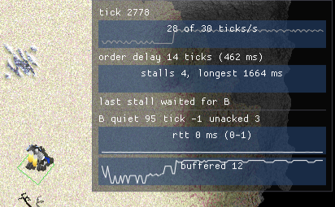

# Reading the network overlay

F9 in a game puts a see-through panel under the top bar, on the right. It shows
how the lockstep is doing on this machine: how fast ticks are running, whether
they are stalling and on whom, and for each other player how their connection
looks from here. It takes no input, so clicks go through it to the game.

It is recorded whether or not it is showing. Pressing F9 after something went
wrong still shows the last thirty seconds.

It only watches. Nothing on it is saved, hashed or read by the simulation, so
turning it on cannot cause a desync.

## What it is measuring

A tick cannot run until every player's commands for that tick have arrived. To
give them time to arrive, each machine holds its own orders back some number of
ticks before the simulation sees them -- the *order delay* -- and sends them on
ahead. If a peer's commands for the next tick still have not arrived when it is
due, every machine waits. That wait is a *stall*.

So there are two ways a game goes wrong:

- **Stalls.** The game freezes for everybody, in bursts. The cause is always
  one peer whose commands arrived late: a spike on their connection, packet
  loss, or their machine stopping.
- **Slowness.** No freezes, but the game runs below speed. Machines are kept
  within a few ticks of each other, so one that cannot keep up holds the rest
  back to its pace.

The panel is laid out to tell these apart, and to name who is responsible.

## Every figure is a quarter-second's worst

The panel moves four times a second, not every frame, so the numbers stay
still long enough to read. Each sample is the **worst** value in its
quarter-second -- the highest round trip, the longest silence, the fewest
commands buffered -- because the frame that goes wrong is the one that
matters, and it would otherwise fall between samples. Each graph is the last
thirty seconds of those samples, oldest on the left.

## The top half: this machine

**tick N**, then the **tick rate graph**, captioned "28 of 30 ticks/s". The
second figure is what the game speed asks for. A healthy game sits on the
line. Dips below it are ticks this machine did not run, from stalls or from
being held back to a slower peer's pace. "paused" replaces the caption while
the game is paused.

**order delay N ticks (M ms)** is how long an order you give waits before the
simulation sees it. It is set from the worst average round trip among your
peers, so one distant player raises it for you. It is the pause between clicking
and a unit moving.

**The stall bars.** One bar per quarter-second, as tall as the time spent
stalled in it; a full-height bar is a quarter-second frozen. The caption counts
stalls and gives the longest. A wait shorter than one tick (33 ms) is a packet
arriving a frame late, happens throughout a healthy game, and is not counted as
a stall, though it still draws a sliver of bar.

**STALLED N ms, waiting for Bob** appears in red while a stall is going on.
Afterwards the line reads "last stall waited for Bob". That name is the answer
to "whose fault was that freeze".

## The bottom half: one block per peer

A line of three figures, then two graphs.

**quiet** -- milliseconds since anything at all arrived from them. Every peer
sends a packet every 100 ms whether it has anything to say or not, so this
saw-tooths between 0 and about 100 in a healthy game. Yellow over 300, red over
1000. When it climbs and keeps climbing, they have stopped sending: their game
froze, crashed, or lost its connection. Past the drop timeout they are dropped.

**tick +N / -N** -- how far ahead (+) or behind (-) of you they are, in ticks.
It is their last reported tick, plus half the round trip for the time the
report spent travelling, plus the ticks they will have run since it arrived.
Machines are held within 3 ticks of each other, so -3 to +3 is normal. Yellow
beyond 3, red beyond 10.

- **Steadily negative, and their tick rate low on their own panel:** their
  machine cannot keep up. Everyone else will be held back towards their pace,
  which shows as your tick rate dipping with no stall bars.
- **Negative and falling fast, with quiet climbing:** they have stopped. The
  projection stops after 200 ms of silence, so a frozen peer falls behind
  instead of appearing to keep pace.
- **Steadily positive:** you are the slow one.

**unacked** -- command sets you have sent them that they have not
acknowledged. Sets go out about one a tick and wait at least a send interval
and a round trip for the acknowledgement, so a handful is normal. Yellow over
30 (a second's worth), red over 90. If it keeps climbing while their quiet stays
low, they are sending to you but your packets are not reaching them, or their
acknowledgements are not reaching you: loss in one direction.

**The rtt graph** -- the round trip to them in milliseconds, captioned with
the average and the lowest and highest of the last five seconds: "rtt 62 ms
(48-140)". The line is coloured by that highest figure: yellow over 250, red
over 500. It is coloured by the worst and not the average because a spike is
what stalls a game, and the order delay is sized from the average -- a
connection that swings between 50 and 400 ms will stall where a steady 200 ms
one with the same average will not.

A round trip is only measured when an acknowledgement arrives, so while none
are arriving the graph plots the lower bound instead: how long the oldest
unacknowledged packet has been out, less the 100 ms a peer can hold an
acknowledgement before sending it. The caption then reads **"rtt >= N ms, no
ack"** in red. This is the graph that climbs during a stall.

**The buffered graph** -- how many ticks of their commands this machine is
holding, ready to run. This is the one that predicts a stall: when it reaches 0
the next tick has nothing to run with from them, and the game waits. A healthy
peer holds about the order delay's worth. The line is yellow at 2 or below and
red at 0.

## Reading it: symptoms and causes

| What you see | What it means |
| --- | --- |
| Stall bars, one peer's buffered hitting 0, their rtt spiking | Their connection is jittery. Their commands arrived late in bursts. |
| Stall bars, one peer's quiet climbing past a few hundred ms | They stopped sending: frozen, crashed, or disconnected. |
| Their unacked climbing, their quiet low | Packet loss in one direction between you. |
| Your tick rate below target, no stall bars, one peer steadily negative | That peer's machine is too slow, and the game is holding everyone to it. |
| Your tick rate below target, no stall bars, every peer steadily positive | Your machine is the slow one. |
| Order delay high, no stalls | One peer is a long way away. Orders feel sluggish, but the game is fine. |

Every figure is from this machine's side. A problem between two other players
shows on their panels, not yours, so a bug report is worth a screenshot of each
player's.

## Things that look wrong and are not

- **rtt reads 0 on loopback.** Round trips are measured in whole milliseconds,
  and two games on one machine answer in a fraction of one.
- **quiet saw-tooths up to about 100.** That is the send interval.
- **A thin stall bar now and then, with the count not moving.** A packet was a
  frame late. Under a tick, it is not counted.
- **Your own tick rate reads a little under target for a moment after a
  stall.** The ticks lost to the stall are not all made back at once.
- **tick +/- wanders at any game speed other than 1x.** A peer's tick is
  projected forward at the normal rate, because a packet does not yet say what
  speed or pause state its sender is in. Issue #354 adds that.

## The code

`GameScene::renderNetworkOverlay` and `recordNetworkHistory`
(`src/rwe/game/GameScene_peers.cpp`) draw and feed it; `NetworkHistory`
keeps the samples; `LockstepStats` times the stalls from `tryTickGame`; and
`GameNetworkService::getPeerStatuses` supplies each peer's figures, once a frame
in a single request to the network thread. The colour thresholds are first
guesses and are all in `renderNetworkOverlay`.
